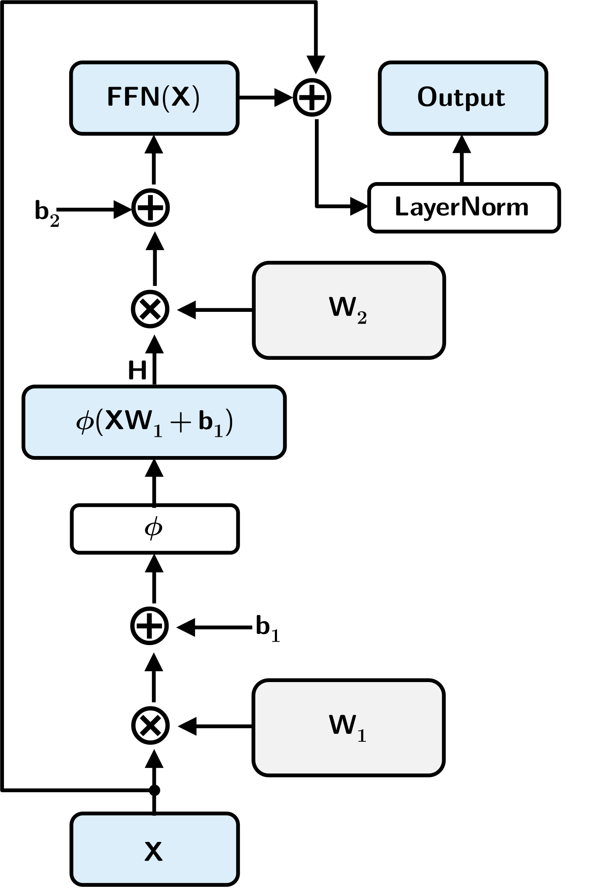
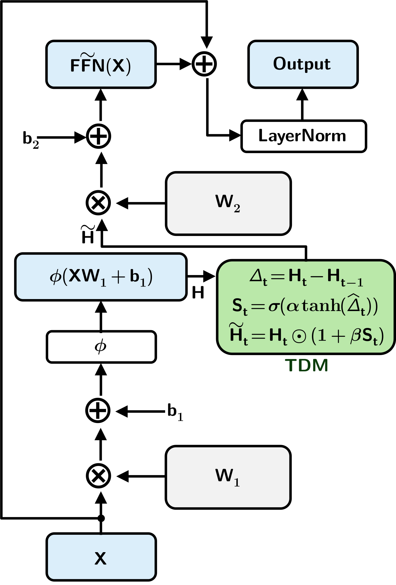

# TDM-Former

**TDM-Former: Transition Dynamics Modulation for Adaptive Token Dynamics in Transformer Neural Machine Translation**

---

## Overview

TDM-Former extends the decoder feed-forward network (FFN) ResBlock of the standard Transformer by introducing Transition Dynamics Modulation (TDM).

TDM captures the relationship between consecutive activated FFN representations and uses this relationship to modulate the current activated FFN representation before the second FFN linear transformation.

---

## Baseline FFN ResBlock

The conventional Transformer FFN ResBlock contains a position-wise FFN with two fully connected linear sublayers and an activation function. Each FFN output is computed from the corresponding activated FFN representation without directly using the preceding activated FFN representation.

  

  <b>Figure: Baseline FFN ResBlock</b>

---

## TDM-Enhanced FFN ResBlock

The proposed TDM-enhanced FFN ResBlock incorporates TDM between the FFN activation and the second linear transformation. TDM computes a transition signal between consecutive activated FFN representations and uses this signal to modulate the current activated FFN representation.

  

  <b>Figure: TDM-enhanced FFN ResBlock</b>

---

## Repository Structure

- `1-Architecture`: Architecture diagrams for the baseline and TDM-enhanced FFN ResBlocks.
- `2-Results`: Translation results, ablation results, efficiency measurements, and plots.
- `3-Experiments`: Training, evaluation, and model implementation files for the evaluated IWSLT translation tasks.

---

## 📄 Architecture Figures (PDF)

- [Baseline FFN ResBlock](1-Architecture/ffn_resblock.pdf)
- [TDM-Enhanced FFN ResBlock](1-Architecture/ffn_tdm_resblock.pdf)

---

## 📊 Translation Results

| Task | Transformer Baseline | TDM-Former | BLEU Gain | Relative Gain | TDM Epoch | Baseline Epoch |
|:---|---:|---:|---:|---:|---:|---:|
| EN → DE | 25.34 | **25.76** | +0.42 | +1.66% | 48 | 48 |
| DE → EN | 30.81 | **31.51** | +0.70 | +2.27% | 47 | 42 |
| EN → RO | 26.31 | **26.63** | +0.32 | +1.22% | 47 | 49 |
| RO → EN | 32.88 | **33.60** | +0.72 | +2.19% | 49 | 49 |
| EN → IT | 28.63 | **28.78** | +0.15 | +0.52% | 49 | 49 |
| IT → EN | 31.87 | **32.63** | +0.76 | +2.38% | 46 | 46 |
| EN → ZH | 20.28 | **20.60** | +0.32 | +1.58% | 49 | 49 |
| ZH → EN | 34.35 | **34.96** | +0.61 | +1.78% | 46 | 46 |

---

## 🧪 Ablation Results

| Model Variant | BLEU | Gain | Relative Gain | Best Epoch |
|:---|---:|---:|---:|---:|
| Transformer Baseline | 30.81 | +0.00 | +0.00% | 42 |
| TDM-Former (L6) | 31.16 | +0.35 | +1.14% | 47 |
| TDM-Former (L5–L6) | 31.37 | +0.56 | +1.82% | 47 |
| **TDM-Former (L4–L6)** | **31.51** | **+0.70** | **+2.27%** | **47** |
| TDM-Former (L3–L6) | 31.54 | +0.73 | +2.37% | 47 |

---
